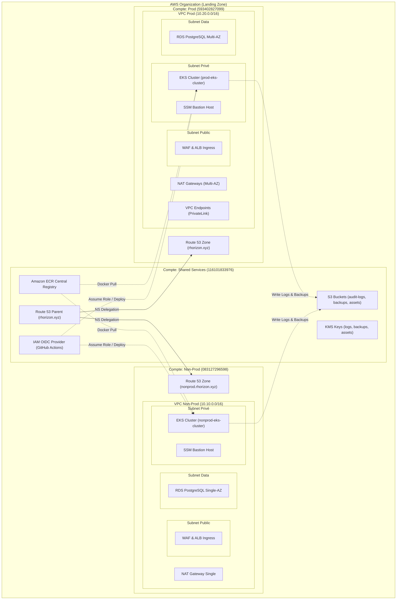

# 🚀 Projet ASD : Architecture de Sécurité Distribuée

## 📌 Présentation Générale
Le projet **ASD** (Architecture de Sécurité Distribuée) est une plateforme SaaS moderne et hautement sécurisée déployée sur **AWS**. Développé dans le cadre d'un **projet de fin d'année**, ce travail vise à démontrer la mise en œuvre concrète d'une infrastructure "Cloud-Native" respectant les standards de sécurité les plus exigeants, notamment les recommandations de l'**ANSSI**.

**Équipe :** Enzo Loppin & Antimi

---

## 🏗️ Philosophie du Projet
Dès sa conception, le projet a été bâti sur deux piliers fondamentaux :
*   **Modularité** : L'ensemble de l'infrastructure est découpé en modules Terraform indépendants et réutilisables.
*   **Reproductibilité** : Grâce à une gestion dynamique des variables (notamment le nom du projet), l'intégralité de la Landing Zone et de la stack applicative peut être redéployée en quelques minutes pour un nouveau client ou un nouvel environnement.

---

## 🏗️ Architecture de la Landing Zone
Nous avons implémenté une **Landing Zone multi-comptes** pour garantir une isolation totale des ressources et des responsabilités :

1.  **Compte Master** : Gouvernance de l'organisation AWS et gestion des accès (SSO).
2.  **Compte Shared Services** : Centre névralgique partagé (Registres ECR, DNS parent, stockage centralisé des logs et sauvegardes).
3.  **Compte Non-Prod** : Environnement de développement et de tests (Staging).
4.  **Compte Prod** : Environnement de production hautement disponible et durci.

---

## 🛡️ Les Piliers de Sécurité (Conformité ANSSI)
Consultez notre **[Checklist de Conformité ANSSI détaillée](./anssi_checklist.md)** pour voir l'ensemble des points de contrôle implémentés.

### 1. Isolation & Moindre Privilège (R4, R11)
*   **Architecture Réseau 3-Tiers** : Le VPC est découpé en trois zones d'isolation logique :
    *   **Tier Public** : Reçoit uniquement l'Ingress ALB et les NAT Gateways. Aucune ressource applicative n'est exposée ici.
    *   **Tier Privé** : Héberge le cluster EKS. Les pods sont isolés d'internet et ne peuvent communiquer vers l'extérieur que via les NAT Gateways.
    *   **Tier Data** : Zone ultra-isolée sans aucune route vers internet, dédiée exclusivement à la base de données RDS PostgreSQL.
*   Authentification **OIDC** pour la CI/CD (GitHub Actions) sans clés statiques. Les pipelines sont limités au build et scan des images.
*   **Souveraineté de l'Infrastructure** : Le déploiement IaC est volontairement exclu de la CI/CD pour prévenir les supply-chain attacks. L'administration se fait exclusivement via un **SSM Bastion Host** sécurisé (pas de ports SSH ouverts).

### 2. Sécurité Applicative & Conteneurs (R2, R8)
*   **Signature des images** : Toutes les images Docker sont signées avec **Cosign**.
*   **Contrôle d'admission** : Utilisation de **Kyverno** pour bloquer toute image non signée dans le cluster.
*   **Runtime Security** : Les conteneurs s'exécutent en mode non-root avec des privilèges restreints.

### 3. Protection des Données (R7)
*   Chiffrement intégral au repos et en transit via **AWS KMS**.
*   **Object Lock** (WORM) sur les logs d'audit pour garantir leur intégrité légale.
*   Base de données **RDS PostgreSQL** isolée dans des sous-réseaux non-routables.

---

## 📊 Observabilité & Résilience
*   **Supervision** : Stack Prometheus & Grafana pour le monitoring en temps réel.
*   **Logs Centralisés** : Collecte via Fluent Bit vers CloudWatch et archivage longue durée sur S3.
*   **Haute Disponibilité** : Déploiement Multi-AZ en production pour garantir la continuité de service.

---

## 🛠️ Stack Technique
*   **Infrastructure** : Terraform (IaC)
*   **Cloud** : Amazon Web Services (AWS)
*   **Orchestration** : Kubernetes (Amazon EKS)
*   **Base de données** : PostgreSQL (Amazon RDS)
*   **Sécurité** : WAF v2, KMS, Secrets Manager, Kyverno, Cosign
*   **CI/CD** : GitHub Actions

\pagebreak

# Référentiel d'Architecture AWS & Landing Zone (ASD)

Ce document décrit l'architecture multi-comptes réelle du projet **ASD**, telle qu'elle est implémentée dans les configurations Terraform et de CI/CD. 

---

## 🗺️ Schéma Conceptuel Multi-Comptes



---

## 🏢 1. Organisation Multi-Comptes (AWS Organizations)

L'architecture est découpée en trois comptes AWS distincts pour garantir une isolation de sécurité et de facturation :

1. **Compte Master / Root** (`global-org`) : Gestion de l'organisation et du Single Sign-On (AWS IAM Identity Center).
2. **Compte Shared Services** (`shared-services`) : Dépôts d'images, DNS parent, stockage centralisé des logs/backups et authentification CI/CD.
3. **Compte Non-Prod** (`nonprod`) : Environnement de développement et de staging.
4. **Compte Prod** (`prod`) : Environnement de production.

---

## 🛠️ 2. Fiches Techniques par Compte

### 📂 A. Compte `shared-services` (116101833976)
* **VPC Network** : **Aucun VPC**. Toutes les ressources de ce compte sont globales ou régionales, sans attachement réseau local.
* **Composants clés** :
  * **Route 53** : Zone DNS parente racine `rhorizon.xyz`. Reçoit les serveurs de noms (NS) depuis Namecheap. Elle délègue les sous-domaines aux comptes enfants.
  * **Amazon ECR** : Registre centralisé (`rhzorion/frontend` et `rhzorion/backend`). Une politique ECR cross-account autorise les comptes `nonprod` et `prod` à tirer (pull) les images Docker.
  * **Amazon S3 & KMS** : 
    * Bucket `rhorizon-audit-logs` (activé avec **Object Lock** en mode Compliance de 90 jours pour l'immuabilité légale des logs d'audit).
    * Bucket `rhorizon-central-backups` pour le stockage des sauvegardes RDS.
    * Bucket `rhorizon-app-assets` pour les objets applicatifs.
    * 3 clés KMS gérées par le compte et partagées avec rotation automatique des clés activée.
  * **IAM OIDC & CI/CD** : 
    * Fournisseur OIDC configuré pour **GitHub Actions** (`token.actions.githubusercontent.com`).
    * Rôle IAM `shared-github-actions-role` disposant de la politique `AdministratorAccess`.

---

### 📂 B. Compte `nonprod` (083127296598)
* **VPC Network** : VPC `10.10.0.0/16` réparti sur 2 Zones de Disponibilité (AZ).
  * **Public Subnets** : NAT Gateway (stratégie `single` pour économie de coûts) et Ingress Application Load Balancer (ALB).
  * **Private Subnets** : Instances EKS (pas d'IP publique). Accès internet sortant via la NAT Gateway.
  * **Data Subnets** : Instances RDS PostgreSQL. Totalement isolées (aucune route vers internet).
  * **VPC Endpoints** : Désactivés (choix d'optimisation budgétaire).
* **Composants clés** :
  * **Base de données RDS** : 
    * Instance unique PostgreSQL (`db.t4g.micro`, 20 Go).
    * Pas de Multi-AZ. Protection contre la suppression désactivée.
  * **Cluster EKS** : 
    * `nonprod-eks-cluster` (Kubernetes v1.32).
    * Managed node group d'instances `t3.medium`.
    * Access Entry configuré pour autoriser l'administration k8s par l'identité IAM assumée par GitHub Actions.
  * **Réseau Kubernetes** :
    * `network-policy.yaml` restreignant l'accès au backend uniquement depuis le pod frontend.
  * **Secrets** : Secrets Store CSI Driver + AWS Secrets Manager Provider (ASCP) synchronisant les secrets préfixés par `nonprod/rhzorion/`.
  * **Bastion** : SSM Bastion Host hébergé en subnet privé pour l'administration et les tunnels de base de données (sécurité sans SSH ouvert).
  * **Observabilité** : Kube-Prometheus-Stack + Grafana.

---

### 📂 C. Compte `prod` (593402827099)
* **VPC Network** : VPC `10.20.0.0/16` réparti sur 3 Zones de Disponibilité (AZ) pour la haute disponibilité.
  * **Public Subnets** : NAT Gateways redondantes (une par AZ) et Ingress ALB.
  * **Private Subnets** : EKS Nodes (haute disponibilité).
  * **Data Subnets** : RDS PostgreSQL Multi-AZ.
  * **VPC Endpoints (AWS PrivateLink)** : **Activés**. Les API AWS (KMS, ECR, Secrets Manager, CloudWatch, STS) et S3 (Gateway) sont appelées en interne sans transiter par internet.
* **Composants clés** :
  * **Base de données RDS** : 
    * Instance PostgreSQL Multi-AZ (`db.t4g.medium`, 50 Go) pour basculement automatique.
    * Chiffrement activé avec la clé KMS partagée depuis le compte `shared-services`.
    * Protection contre la suppression activée, sauvegardes conservées 30 jours, snapshots finaux obligatoires.
  * **Cluster EKS** : 
    * `prod-eks-cluster` (Kubernetes v1.32).
    * Managed node group Multi-AZ auto-scalable.
  * **Ingress & DNS** :
    * Certificat SSL ACM et AWS WAF avec **règles étendues** activées pour parer les attaques complexes (OWASP Top 10).

---

## 🔄 3. Liaisons & Flux Transverses (Cross-Account)

1. **Résolution DNS** :
   Le registrar externe (Namecheap) délègue la gestion de la zone DNS racine `rhorizon.xyz` au serveur Route 53 du compte `shared-services`.
   Le compte `shared-services` délègue :
   * Le sous-domaine `nonprod.rhorizon.xyz` vers le compte `nonprod`.
   * Le sous-domaine `prod.rhorizon.xyz` vers le compte `prod`.

2. **Rapports & Logs Centralisés** :
   Les workloads d'EKS (Non-Prod & Prod) envoient leurs sauvegardes et les logs de sécurité (Fluent Bit, CloudWatch) vers les buckets S3 du compte `shared-services` en chiffrant les flux via les clés KMS centralisées.

3. **Déploiement CI/CD** :
   * GitHub Actions s'authentifie via OIDC auprès du compte `shared-services` pour endosser le rôle d'administration.
   * Il utilise ensuite les rôles EKS Access Entries locaux dans chaque compte pour déployer les manifests applicatifs sur les clusters `nonprod` et `prod`.

\pagebreak

# Matrice de Flux et Groupes de Sécurité (Security Groups)

L'infrastructure RHZORION repose sur une segmentation réseau stricte par **Security Groups (SG)**, agissant comme des pare-feu à état (stateful) au niveau des interfaces réseau (ENI).

## 🛡️ Principes de Filtrage
*   **Principe du moindre privilège** : Seuls les flux strictement nécessaires au fonctionnement des services sont autorisés.
*   **Chaînage de Security Groups** : Au lieu d'utiliser des plages IP (CIDR), les règles utilisent les IDs des SGs sources, garantissant que seule la ressource légitime peut communiquer, même si son IP change.
*   **Egress Control** : Le trafic sortant est restreint vers l'Internet, privilégiant les VPC Endpoints pour les services AWS.

## 📊 Matrice de Flux Inter-Tiers

| Source SG | Destination SG | Port / Protocole | Description |
|-----------|----------------|------------------|-------------|
| **Any (0.0.0.0/0)** | Public ALB | 80/443 (TCP) | Accès utilisateur web (HTTP/HTTPS) |
| **Public ALB** | EKS Nodes (App) | 8080-8443 (TCP) | Transfert du trafic vers les conteneurs |
| **EKS Nodes (App)** | RDS Database | 5432 (TCP) | Accès à la base de données PostgreSQL |
| **EKS Nodes (App)** | Any (0.0.0.0/0) | 53 (UDP/TCP) | Résolution DNS (CoreDNS) |
| **EKS Nodes (App)** | Any (0.0.0.0/0) | 443 (TCP) | Appels API AWS (via NAT ou Endpoints) |

## 🛠️ Détail des Security Groups

### 1. SG-ALB (Load Balancer Public)
*   **Rôle** : Point d'entrée unique de la plateforme.
*   **Entrée** : Autorise HTTP (80) et HTTPS (443) depuis n'importe où.
*   **Sortie** : Restreint aux ports applicatifs du tier EKS uniquement.

### 2. SG-APP (Cluster EKS / Nodes)
*   **Rôle** : Hébergement des micro-services backend et frontend.
*   **Entrée** : Flux limités provenant de l'ALB sur les ports de service. Autorise également les flux internes Kubernetes (CoreDNS).
*   **Sortie** : Limitée à la base de données (5432) et aux services externes essentiels (443 pour les API AWS).

### 3. SG-RDS (Base de Données)
*   **Rôle** : Tier de données persistant.
*   **Entrée** : **Strictement limité** au trafic provenant du SG-APP sur le port 5432. Aucune autre source ne peut interroger la base.
*   **Sortie** : Limitée au sein du VPC uniquement.


\pagebreak

# Gestion des Identités (IAM) et du Chiffrement (KMS)

La sécurité de la plateforme RHZORION repose sur une gestion granulaire des droits d'accès et une protection systématique des données au repos via le chiffrement.

## 🔑 Gestion des Identités et des Accès (IAM)

L'architecture IAM suit strictement le principe du **moindre privilège** et favorise l'utilisation d'identités temporaires plutôt que de clés d'accès statiques.

### 🛡️ Concepts Clés
*   **IRSA (IAM Roles for Service Accounts)** : Les applications tournant sur EKS n'utilisent pas les droits des nœuds de calcul. Chaque micro-service possède son propre rôle IAM via un fournisseur OIDC, limitant ainsi l'impact en cas de compromission d'un Pod.
*   **Fédération d'Identité (OIDC)** : Pour le déploiement CI/CD, GitHub Actions utilise des rôles IAM temporaires via OIDC, supprimant le besoin de stocker des `AWS_ACCESS_KEY` dans les secrets GitHub.
*   **Séparation des Privilèges** : Les rôles sont segmentés par fonction (Cluster EKS, Nœuds, Driver CSI, Gestion des Secrets).

### 📊 Principaux Rôles IAM

| Rôle | Portée | Fonction de Sécurité |
|------|--------|----------------------|
| `eks-cluster-role` | EKS Control Plane | Permet à AWS de gérer les ressources réseau et de calcul pour Kubernetes. |
| `eks-node-role` | Worker Nodes | Droits limités pour rejoindre le cluster et tirer des images ECR. |
| `secrets-app-role` | Pods applicatifs | Autorise uniquement la lecture des secrets spécifiques dans Secrets Manager. |
| `fluent-bit-role` | Observabilité | Permet l'envoi sécurisé des logs vers CloudWatch et S3. |
| \`github-actions-role\` | CI/CD (Build/Scan) | Droits limités au push ECR et au scan de vulnérabilités. Aucun droit de modification de l'infrastructure. |


---

## 🔒 Stratégie de Chiffrement (AWS KMS)

Toutes les données sensibles (logs, backups, images, secrets) sont chiffrées avec des **Customer Managed Keys (CMK)**, offrant un contrôle total sur les politiques d'accès.

### 🛡️ Sécurité des Clés
*   **Rotation Automatique** : Les clés KMS sont configurées pour une rotation annuelle automatique des matériaux de clé.
*   **Politiques de Clé (Key Policies)** : L'accès aux clés est restreint au niveau du service AWS et du rôle IAM utilisateur, empêchant même les administrateurs globaux d'accéder aux données sans autorisation spécifique.
*   **Séparation des Tâches** : Des clés distinctes sont utilisées pour les logs, les sauvegardes et les assets afin de compartimenter les risques.

### 🛠️ Utilisation des Clés KMS

| Clé KMS | Usage | Bénéfice Sécurité |
|---------|-------|-------------------|
| **KMS Logs** | CloudWatch, S3 Logs, Flow Logs | Confidentialité des traces d'audit et des journaux applicatifs. |
| **KMS Backups** | Snapshots RDS, S3 Backups | Protection des données de secours contre l'extraction non autorisée. |
| **KMS ECR** | Images Docker | Chiffrement des artefacts logiciels avant déploiement. |
| **KMS Secrets** | Secrets Manager | Sur-chiffrement des mots de passe et clés API en base. |


\pagebreak

# Scan de Sécurité de l'Infrastructure (Checkov)

Dans le cadre de la démarche **DevSecOps** du projet RHZORION, un scan automatisé de l'infrastructure en tant que code (IaC) a été réalisé à l'aide de l'outil **Checkov**.

## 📊 Résumé du Scan
*   **Total de tests passés** : 244
*   **Total de tests échoués** : 61
*   **Conformité globale** : ~80%

## 🛡️ Analyse des points critiques identifiés

Le scan a identifié plusieurs axes d'amélioration, dont certains sont des choix de conception assumés pour ce prototype, tandis que d'autres feront l'objet d'une remédiation future.

### 1. Identité et Accès (IAM)
*   **Observation** : Certaines politiques IAM pour les rôles GitHub Actions sont jugées trop permissives (usage de l'action `*`).
*   **Justification ASD** : Les rôles sont restreints par des conditions de confiance OIDC, limitant l'usage au dépôt spécifique. Une granularité plus fine sera appliquée en phase de production.

### 2. Sécurité du Cluster EKS (Remédié ✅)
*   **Action réalisée** : L'accès public à l'API Kubernetes a été totalement **désactivé** (\`endpoint_public_access = false\`). L'administration se fait désormais exclusivement via le **bastion SSM** présent dans le VPC.
*   **Logging** : Les 5 types de logs du control plane (API, Audit, Authenticator, etc.) ont été activés pour une traçabilité complète.
*   **Impact** : Élimination de la surface d'attaque externe sur le plan de contrôle Kubernetes.

### 3. Base de Données RDS (Remédié ✅)
*   **Action réalisée** : L'authentification IAM (\`iam_database_authentication_enabled = true\`) a été activée. 
*   **Fonctionnement** : Les applications n'ont plus besoin de stocker un mot de passe en dur. Elles génèrent un jeton d'authentification temporaire via leur rôle IAM pour se connecter à la base.
*   **Sécurité** : Suppression totale des risques liés à la fuite de mots de passe statiques et rotation automatique gérée par IAM.

### 4. Réseau (Security Groups)
*   **Observation** : Le Security Group de l'ALB autorise le port 80 (HTTP).
*   **Justification** : Le port 80 est ouvert uniquement pour effectuer une redirection forcée vers le port 443 (HTTPS), conformément aux standards web actuels.

## 🚀 Conclusion du Scan
La majorité des contrôles de sécurité fondamentaux (chiffrement KMS au repos, isolation des sous-réseaux, immuabilité ECR) sont **validés**. Les points restants concernent principalement le durcissement (hardening) avancé et le monitoring détaillé, qui s'inscrivent dans le cycle d'amélioration continue du projet.


\pagebreak

# Analyse de Risques Globale & Modélisation des Menaces (Conformité ANSSI R10)

Ce document présente l'analyse de risques et la modélisation des chemins de compromission du projet **ASD**, conformément aux exigences de la recommandation **R10 de l'ANSSI**.

---

## 🗺️ 1. Chemins de Compromission & Vecteurs d'Attaque

L'analyse de risque identifie quatre grands vecteurs d'attaque sur notre architecture cloud et logicielle :

```
[Attaquant]
     │
     ├──► [Poste Développeur] ──────► Vol de jetons, Commits malveillants
     ├──► [Dépendances / Tierce] ───► Empoisonnement de packages (Supply Chain)
     ├──► [Chaîne CI/CD (GitHub)] ──► Compromission de runner, élévation AWS
     └──► [Infrastructure AWS] ────► Exploits réseau, accès API EKS, fuite BDD
```

---

## 🛡️ 2. Analyse Détaillée des Risques et Contre-Mesures

### Vecteur A : Compromission du Poste Développeur (Workstation Compromise)
* **Description** : Un attaquant compromet la machine d'un développeur (via phishing, malware) pour récupérer ses accès AWS/Git ou injecter du code malveillant directement dans le dépôt.
* **Gravité Potentielle** : Critique (accès direct au code source).

| Scénarios de Risque | Contre-Mesures Implémentées dans le Projet | Statut |
| :--- | :--- | :---: |
| **Fuite de clés d'accès AWS statiques** | **Zéro clé AWS statique** : Les développeurs utilisent l'authentification SSO via AWS IAM Identity Center. La CI/CD utilise des rôles OIDC temporaires sans secrets stockés. | **SÉCURISÉ** |
| **Commit de code malveillant usurpant l'identité** | **Signature des Commits obligatoire (R3)** : Intégration du workflow `check-signed-commits.yml` qui rejette toute PR contenant des commits non signés cryptographiquement par la clé privée du développeur. | **SÉCURISÉ** |
| **Poussée accidentelle de secrets (mots de passe, tokens)** | **Scan de Secrets pré-build (R1)** : Trivy FS analyse le dépôt local et la CI/CD à la recherche de secrets en clair avant chaque build. | **SÉCURISÉ** |

---

### Vecteur B : Risque de la Chaîne d'Approvisionnement (Supply Chain / Tierce partie)
* **Description** : Compromission de librairies externes (via empoisonnement de package pip) ou de l'image de base Nginx/Python.
* **Gravité Potentielle** : Élevée (exécution de code arbitraire dans les conteneurs).

| Scénarios de Risque | Contre-Mesures Implémentées dans le Projet | Statut |
| :--- | :--- | :---: |
| **Introduction de dépendances vulnérables** | **Scan de vulnérabilités applicatives (SCA) (R1)** : `pip-audit` analyse systématiquement le fichier `requirements.txt` du backend dans la CI/CD pour bloquer les packages vulnérables. | **SÉCURISÉ** |
| **Image de base Docker vulnérable** | **Hardening & Scan Trivy (R8)** : Utilisation d'images minimales (`python-slim`, `nginx-unprivileged:alpine`) et scan Trivy régulier des images construites avant déploiement. | **SÉCURISÉ** |
| **Substitution d'image Docker dans le registre (ECR)** | **Signature et Admission Control (R2)** : Les images ECR de production sont signées via Cosign, et le contrôleur d'admission Kyverno sur EKS bloque le démarrage de tout conteneur non signé. | **SÉCURISÉ** |

---

### Vecteur C : Compromission de la Chaîne CI/CD (GitHub Actions)
* **Description** : Un attaquant exploite un runner ou une vulnérabilité de workflow pour exécuter des scripts malveillants et tenter de s'emparer des droits d'administration AWS de la CI/CD.
* **Gravité Potentielle** : Critique (compromission de la Landing Zone).

| Scénarios de Risque | Contre-Mesures Implémentées dans le Projet | Statut |
| :--- | :--- | :---: |
| **Élévation de privilèges vers la Production depuis une branche de Dev** | **Ségrégation stricte des rôles OIDC (R4)** : Le rôle OIDC de Non-Prod n'a aucun droit sur le compte `prod`. Le rôle OIDC de Prod ne peut être endossé que depuis la branche `main` protégée. | **SÉCURISÉ** |
| **Persistance latérale sur les serveurs de build** | **Environnements éphémères (R5)** : Utilisation exclusive de runners virtuels vierges détruits immédiatement après usage. | **SÉCURISÉ** |

---

### Vecteur D : Compromission de l'Infrastructure Cloud (AWS / EKS / RDS)
* **Description** : Attaque réseau directe sur la base de données RDS, l'API EKS, ou rebond latéral depuis un pod compromis.
* **Gravité Potentielle** : Critique (fuite de données).

| Scénarios de Risque | Contre-Mesures Implémentées dans le Projet | Statut |
| :--- | :--- | :---: |
| **Accès direct et non authentifié à la base de données RDS** | **Réseau isolé & Moindre Privilège** : RDS est dans des subnets Data sans route internet. Le Security Group RDS n'autorise que les flux venant du SG d'EKS. Pas de SSH public (Bastion SSM privé uniquement). | **SÉCURISÉ** |
| **Rebond depuis un conteneur web compromis** | **Lecture seule et Network Policies (R8 & R9)** : Les pods tournent en lecture seule (`readOnlyRootFilesystem: true`), sans capacités Linux (`drop: [ALL]`). Les NetworkPolicies Kubernetes bloquent le trafic latéral. | **SÉCURISÉ** |
| **Prise de contrôle de l'API Server EKS** : | **EKS Access Entries & OIDC (R12)** : Remplacement de l'ancienne ConfigMap vulnérable `aws-auth` par les Access Entries natives gérées par AWS IAM. | **SÉCURISÉ** |

\pagebreak

# Cartographie Applicative & Matrice de Flux (Conformité ANSSI R9)

Ce document dresse la cartographie complète de l'application **RHZORION** et de ses dépendances d'infrastructure, détaillant les droits système, l'inventaire des secrets, les flux réseau et les rôles de gouvernance.

---

## 🔑 1. Cartographie des Droits Système & Privilèges

L'architecture utilise le principe du moindre privilège, matérialisé par des rôles IAM AWS, des politiques d'accès Kubernetes et des mécanismes IRSA (IAM Roles for Service Accounts) :

### A. Rôles IAM CI/CD (GitHub Actions)
| Identité IAM | Contexte d'Utilisation | Droits & Privilèges | Source de Contrôle |
| :--- | :--- | :--- | :--- |
| `shared-github-actions-nonprod-role` | Exécution des tests et déploiement Non-Prod. | - Assumer des rôles uniquement dans le compte `nonprod` (`083127296598`).<br>- Lecture seule ECR. | `modules/cicd-infra/main.tf` |
| `shared-github-actions-prod-role` | Déploiement Production (déclenché depuis la branche `main`). | - Assumer des rôles dans le compte `prod` (`593402827099`).<br>- Administrateur local sur `shared-services`. | `modules/cicd-infra/main.tf` |

### B. Accès d'Administration aux Clusters EKS
| Identité AWS | Niveau d'accès EKS | Description | Mécanisme de contrôle |
| :--- | :--- | :--- | :--- |
| `OrganizationAccountAccessRole` | `AmazonEKSClusterAdminPolicy` | Droits d'administration totale du cluster pour l'équipe DevOps. | EKS Access Entries (`eks-basic`) |
| `shared-github-actions-nonprod-role` | `AmazonEKSClusterAdminPolicy` | Droits de déploiement automatique sur le cluster Non-Prod. | EKS Access Entries (`live/nonprod/main.tf`) |
| `shared-github-actions-prod-role` | `AmazonEKSClusterAdminPolicy` | Droits de déploiement automatique sur le cluster Prod. | EKS Access Entries (`live/prod/main.tf`) |

### C. Droits d'Accès Applicatifs (IRSA)
| Pod / ServiceAccount Kubernetes | Rôle IAM Associé (IRSA) | Privilèges Accordés | Raison d'être |
| :--- | :--- | :--- | :--- |
| `rhorizon-backend-sa` (dans le namespace `rhorizon`) | `rhorizon-[env]-backend-s3-role` | - `s3:GetObject`, `PutObject`, `DeleteObject` sur le bucket d'assets.<br>- `kms:Decrypt`, `GenerateDataKey` sur la clé KMS des assets. | Le backend doit stocker et lire les documents utilisateurs dans le bucket S3 sécurisé. |
| `rhzorion-app-sa` (dans le namespace `default`) | `[env]-eks-secrets-role` | - `secretsmanager:GetSecretValue` sur le chemin `${env}/rhzorion/*`. | Le CSI Driver a besoin de ce rôle pour charger et synchroniser les secrets AWS. |

---

## 🔒 2. Inventaire & Cycle de Vie des Secrets

Aucun secret n'est stocké en dur ou stocké dans les configurations Git.

### A. Secrets de Fonctionnement (AWS Secrets Manager)
| Nom du Secret (AWS) | Portée / Env | Contenu / Clés | Consommateur dans EKS | Type de Stockage |
| :--- | :--- | :--- | :--- | :--- |
| `[env]/rhzorion/app-secrets` | Applicatif | `database_host`, `database_user`, `database_password`, `jwt_secret_key` | Pods backend (via Secrets Store CSI Driver) | Chiffré KMS centralisé |
| Secret GitHub `DB_PASSWORD` | Déploiement | Mot de passe administrateur de la base RDS (PostgreSQL) | Pipeline de déploiement (`deploy.sh`) | Secrets encryptés GitHub |

---

## 🔄 3. Matrice de Flux Réseau & Table de Filtrage (Conformité ANSSI R9)

Les flux réseau sont contrôlés de manière redondante :
1. Au niveau AWS via les **Groupes de Sécurité (Security Groups)**.
2. Au niveau Kubernetes via les **Network Policies**.
3. Au niveau de la périphérie cloud via **AWS WAFv2**.

```
[Utilisateur Externe]
       │ (HTTPS/443)
       ▼
 [AWS WAFv2] (Filtrage)
       │ (HTTPS/443)
       ▼
  [Ingress ALB] (VPC Public)
       │ (HTTP/8080)
       ▼
 [Frontend Pod] (VPC Privé App)
       │ (TCP/5000)
       ▼
  [Backend Pod] ──(TCP/5432)──► [RDS Database] (VPC Privé Data)
       │
       ├─(HTTPS/443)─► [VPC Endpoints / S3 Assets / Secrets Manager]
       └─(HTTPS/443)─► [Amazon ECR]
```

### Matrice Exhaustive des Flux Réseau :
| Source | Destination | Port | Protocole | Rôle / Description | Mécanisme de Filtrage |
| :--- | :--- | :--- | :--- | :--- | :--- |
| **Internet (Utilisateurs)** | **AWS WAFv2** | `80`, `443` | TCP | Requêtes HTTP/HTTPS entrantes du public. | AWS WAFv2 (Filtrage OWASP, Rate Limit, Geo-blocking) |
| **AWS WAFv2** | **Ingress ALB** | `80`, `443` | TCP | Transmission des requêtes validées (propres). | Security Group `alb` (Autorise uniquement le trafic HTTPS clean) |
| **Ingress ALB** | **Frontend Pod** | `8080` | TCP | Redirection du trafic web déchiffré vers Nginx. | Security Group `app` & `NetworkPolicy` (Namespace `rhorizon`) |
| **Ingress ALB** | **Backend Pod** | `5000` | TCP | Redirection directe des requêtes de l'API `/api/*`. | Security Group `app` & `NetworkPolicy` |
| **Frontend Pod** | **Backend Pod** | `5000` | TCP | Appels API internes du code Javascript client vers le Flask Backend. | `NetworkPolicy` (Autorise uniquement si label `app: rhorizon-frontend`) |
| **Backend Pod** | **RDS PostgreSQL** | `5432` | TCP | Connexions et requêtes SQL à la base de données. | Security Group `rds` (Autorise exclusivement le Security Group `app`) |
| **EKS Nodes / Pods** | **AWS Secrets Manager** | `443` | TCP (HTTPS) | Récupération des secrets par le *Secrets Store CSI Driver*. | VPC Endpoint pour Secrets Manager (`com.amazonaws.[region].secretsmanager`) |
| **EKS Nodes / Pods** | **Amazon S3 (Assets)** | `443` | TCP (HTTPS) | Stockage et lecture de documents applicatifs. | VPC Endpoint Gateway S3 (`com.amazonaws.[region].s3`) |
| **EKS Nodes (Workers)** | **Amazon ECR** | `443` | TCP (HTTPS) | Récupération (pull) des images de conteneurs. | VPC Endpoints pour ECR (`ecr.api` & `ecr.dkr`) |
| **EKS Control Plane** | **EKS Nodes (Workers)** | `10250`, `443` | TCP | Communication et pilotage des pods par Kubernetes. | Security Group d'EKS (ENIs cross-account managées par AWS) |
| **Metrics Server / HPA** | **EKS Nodes (Workers)** | `10250`, `443` | TCP | Collecte des métriques CPU/RAM des pods pour l'Auto Scaling. | Security Group d'EKS & `NetworkPolicy` interne |
| **CloudTrail (Master)** | **S3 Audit Logs (Shared)** | `443` | TCP (HTTPS) | Dépôt centralisé des logs d'API de l'organisation. | S3 Bucket Policy (Restreint au principal `cloudtrail.amazonaws.com`) |
| **Bastion / DevOps Admin** | **EKS Nodes / RDS** | `443` | TCP | Session d'administration sécurisée via AWS Systems Manager. | AWS SSM Session Manager (Aucun port ouvert, flux sortant SSM Agent) |

---

## 👥 4. Gouvernance & Droits d'Accès des Développeurs

Pour garantir l'intégrité du code source de bout en bout, le workflow Git respecte les règles suivantes :

1. **Rôles des Développeurs** :
   * **Développeurs (Rôle Read/Write)** : Peuvent créer des branches de fonctionnalités (`feature/*`), pousser des commits signés, et soumettre des Pull Requests.
   * **Relecteurs / Maintainers (Rôle Admin/Maintainer)** : Seuls autorisés à fusionner (merge) le code vers la branche `main` après validation manuelle des tests unitaires et des scans de sécurité (Bandit, Checkov, Trivy).
2. **Politique de Protection de Branche (`main`)** :
   * Approbation par au moins un relecteur obligatoire.
   * Passage obligatoire des vérifications de sécurité dans la CI/CD (y compris le scan des signatures de commits).
   * Interdiction de faire du Force Push.

\pagebreak

# Guide de Développement Sécurisé (ASD)

Ce document régit les règles et standards de développement sécurisé à respecter par l'ensemble des contributeurs du projet **ASD**, conformément aux exigences de la recommandation **R7 de l'ANSSI**.

---

## 🛡️ 1. Prévention des Injections SQL

L'une des vulnérabilités les plus critiques est l'injection SQL. 
* **Règle absolue** : **Ne jamais concaténer** de variables ou de chaînes de caractères pour construire des requêtes SQL.
* **Bonne Pratique** : Utiliser systématiquement les requêtes paramétrées fournies par le driver de base de données (`psycopg2`). Les valeurs utilisateur doivent être passées en tant que tuple de paramètres distinct.

### ❌ Mauvaise Pratique (Vulnérable) :
```python
# VULNÉRABLE - N'utilisez jamais cette syntaxe !
cur.execute("SELECT * FROM employees WHERE name = '" + data['name'] + "';")
```

###  Bonne Pratique (Sécurisée) :
```python
# SÉCURISÉ - Paramétrage natif
cur.execute("SELECT * FROM employees WHERE name = %s;", (data['name'],))
```

---

## 🌐 2. Sécurisation des Politiques CORS (Cross-Origin Resource Sharing)

Pour empêcher des sites malveillants d'appeler notre API depuis le navigateur d'un utilisateur légitime :
* **Développement** : L'origine wildcard (`*`) est autorisée par défaut dans l'environnement local.
* **Production** : La politique CORS doit être restreinte aux domaines officiels du projet. Elle est configurée via la variable d'environnement `ALLOWED_CORS_ORIGINS`.

### Exemple de configuration :
```python
# Chargement des origines autorisées depuis l'environnement
allowed_origins = os.environ.get("ALLOWED_CORS_ORIGINS", "https://votre-domaine.xyz").split(",")
CORS(app, resources={r"/api/*": {"origins": allowed_origins}})
```

---

## 🚨 3. Gestion des Erreurs et Fuites d'Informations

L'affichage de traces d'appels (stack traces) ou de messages d'erreurs internes détaillés (détails de connexion DB, structure des tables) fournit des indices précieux aux attaquants.
* **Règle** : Les erreurs système internes doivent être journalisées avec un niveau `ERROR` côté serveur, mais renvoyer un message d'erreur générique et sécurisé à l'utilisateur.

### ❌ Mauvaise Pratique :
```python
except Exception as e:
    # Renvoyer l'erreur brute peut divulguer le mot de passe ou la structure SQL
    return jsonify({"error": str(e)}), 500
```

###  Bonne Pratique :
```python
except Exception as e:
    logger.error(f"Error updating employee: {e}") # Log complet interne
    return jsonify({"error": "Failed to update employee"}), 500 # Message générique externe
```

---

## 🐳 4. Durcissement des Images Docker & Privilèges

* **Images Minimales** : Toujours privilégier des images de base allégées (ex: `-slim`, `-alpine` ou `distroless`) afin de réduire la surface d'attaque et le nombre de packages vulnérables pré-installés.
* **Utilisateur Non-Root** : Ne jamais exécuter un conteneur en tant que `root`. Un utilisateur non-privilégié doit être explicitement créé et déclaré dans le Dockerfile :
  ```dockerfile
  RUN useradd -u 10001 appuser && chown -R appuser:appuser /app
  USER appuser
  ```

---

## 🔍 5. Outils d'Analyse Statique (SAST) Locaux

Avant de pousser vos modifications sur Git, il est recommandé de lancer les analyseurs de sécurité en local :
1. **Sécurité Python (Bandit)** :
   ```bash
   pip install bandit
   bandit -r app/backend/ -ll
   ```
2. **Scan de Fichiers & Secrets (Trivy)** :
   ```bash
   trivy fs app/frontend/
   ```

\pagebreak

# Documentation Technique des Modules

Ce chapitre détaille la configuration technique, les variables et les enjeux de sécurité pour chaque module Terraform du projet.

