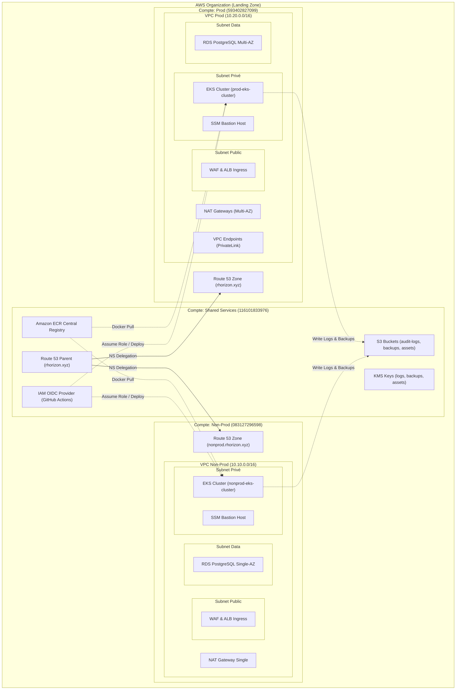

# Référentiel d'Architecture AWS & Landing Zone (ASD)

Ce document décrit l'architecture multi-comptes réelle du projet **ASD**, telle qu'elle est implémentée dans les configurations Terraform et de CI/CD. 

---

## 🗺️ Schéma Conceptuel Multi-Comptes

---

## 🏢 1. Organisation Multi-Comptes (AWS Organizations)

L'architecture est découpée en trois comptes AWS distincts pour garantir une isolation de sécurité et de facturation :

1. **Compte Master / Root** (`global-org`) : Gestion de l'organisation et du Single Sign-On (AWS IAM Identity Center).
2. **Compte Shared Services** (`shared-services`) : Dépôts d'images, DNS parent, stockage centralisé des logs/backups et authentification CI/CD.
3. **Compte Non-Prod** (`nonprod`) : Environnement de développement et de staging.
4. **Compte Prod** (`prod`) : Environnement de production.

---

## 🛠️ 2. Fiches Techniques par Compte

### 📂 A. Compte `shared-services` (116101833976)
* **VPC Network** : **Aucun VPC**. Toutes les ressources de ce compte sont globales ou régionales, sans attachement réseau local.
* **Composants clés** :
  * **Route 53** : Zone DNS parente racine `rhorizon.xyz`. Reçoit les serveurs de noms (NS) depuis Namecheap. Elle délègue les sous-domaines aux comptes enfants.
  * **Amazon ECR** : Registre centralisé (`rhzorion/frontend` et `rhzorion/backend`). Une politique ECR cross-account autorise les comptes `nonprod` et `prod` à tirer (pull) les images Docker.
  * **Amazon S3 & KMS** : 
    * Bucket `rhorizon-audit-logs` (activé avec **Object Lock** en mode Compliance de 90 jours pour l'immuabilité légale des logs d'audit).
    * Bucket `rhorizon-central-backups` pour le stockage des sauvegardes RDS.
    * Bucket `rhorizon-app-assets` pour les objets applicatifs.
    * 3 clés KMS gérées par le compte et partagées avec rotation automatique des clés activée.
  * **IAM OIDC & CI/CD** : 
    * Fournisseur OIDC configuré pour **GitHub Actions** (`token.actions.githubusercontent.com`).
    * Rôle IAM `shared-github-actions-role` disposant de la politique `AdministratorAccess`.

---

### 📂 B. Compte `nonprod` (083127296598)
* **VPC Network** : VPC `10.10.0.0/16` réparti sur 2 Zones de Disponibilité (AZ).
  * **Public Subnets** : NAT Gateway (stratégie `single` pour économie de coûts) et Ingress Application Load Balancer (ALB).
  * **Private Subnets** : Instances EKS (pas d'IP publique). Accès internet sortant via la NAT Gateway.
  * **Data Subnets** : Instances RDS PostgreSQL. Totalement isolées (aucune route vers internet).
  * **VPC Endpoints** : Désactivés (choix d'optimisation budgétaire).
* **Composants clés** :
  * **Base de données RDS** : 
    * Instance unique PostgreSQL (`db.t4g.micro`, 20 Go).
    * Pas de Multi-AZ. Protection contre la suppression désactivée.
  * **Cluster EKS** : 
    * `nonprod-eks-cluster` (Kubernetes v1.32).
    * Managed node group d'instances `t3.medium`.
    * Access Entry configuré pour autoriser l'administration k8s par l'identité IAM assumée par GitHub Actions.
  * **Réseau Kubernetes** :
    * `network-policy.yaml` restreignant l'accès au backend uniquement depuis le pod frontend.
  * **Secrets** : Secrets Store CSI Driver + AWS Secrets Manager Provider (ASCP) synchronisant les secrets préfixés par `nonprod/rhzorion/`.
  * **Bastion** : SSM Bastion Host hébergé en subnet privé pour l'administration et les tunnels de base de données (sécurité sans SSH ouvert).
  * **Observabilité** : Kube-Prometheus-Stack + Grafana.

---

### 📂 C. Compte `prod` (593402827099)
* **VPC Network** : VPC `10.20.0.0/16` réparti sur 3 Zones de Disponibilité (AZ) pour la haute disponibilité.
  * **Public Subnets** : NAT Gateways redondantes (une par AZ) et Ingress ALB.
  * **Private Subnets** : EKS Nodes (haute disponibilité).
  * **Data Subnets** : RDS PostgreSQL Multi-AZ.
  * **VPC Endpoints (AWS PrivateLink)** : **Activés**. Les API AWS (KMS, ECR, Secrets Manager, CloudWatch, STS) et S3 (Gateway) sont appelées en interne sans transiter par internet.
* **Composants clés** :
  * **Base de données RDS** : 
    * Instance PostgreSQL Multi-AZ (`db.t4g.medium`, 50 Go) pour basculement automatique.
    * Chiffrement activé avec la clé KMS partagée depuis le compte `shared-services`.
    * Protection contre la suppression activée, sauvegardes conservées 30 jours, snapshots finaux obligatoires.
  * **Cluster EKS** : 
    * `prod-eks-cluster` (Kubernetes v1.32).
    * Managed node group Multi-AZ auto-scalable.
  * **Ingress & DNS** :
    * Certificat SSL ACM et AWS WAF avec **règles étendues** activées pour parer les attaques complexes (OWASP Top 10).

---

## 🔄 3. Liaisons & Flux Transverses (Cross-Account)

1. **Résolution DNS** :
   Le registrar externe (Namecheap) délègue la gestion de la zone DNS racine `rhorizon.xyz` au serveur Route 53 du compte `shared-services`.
   Le compte `shared-services` délègue :
   * Le sous-domaine `nonprod.rhorizon.xyz` vers le compte `nonprod`.
   * Le sous-domaine `prod.rhorizon.xyz` vers le compte `prod`.

2. **Rapports & Logs Centralisés** :
   Les workloads d'EKS (Non-Prod & Prod) envoient leurs sauvegardes et les logs de sécurité (Fluent Bit, CloudWatch) vers les buckets S3 du compte `shared-services` en chiffrant les flux via les clés KMS centralisées.

3. **Déploiement CI/CD** :
   * GitHub Actions s'authentifie via OIDC auprès du compte `shared-services` pour endosser le rôle d'administration.
   * Il utilise ensuite les rôles EKS Access Entries locaux dans chaque compte pour déployer les manifests applicatifs sur les clusters `nonprod` et `prod`.
