# Architecture de la Landing Zone AWS - RHZORION

Ce document présente l'architecture multi-comptes AWS de notre "Landing Zone" ainsi que les flux de déploiement et d'accès sécurisés.

---

## Schéma d'Architecture (Mermaid)

```mermaid
graph TD
    %% AWS Organization
    subgraph Org ["AWS Organizations (enzo_master)"]
        master[Compte Master / Root]
        ct_master[CloudTrail Org Trail]
        kms_master[KMS Key CloudTrail]

        master --> ct_master
        kms_master --> ct_master
        
        subgraph Shared ["Compte Shared Services (116101833976)"]
            ecr_back[ECR Backend Repo]
            ecr_front[ECR Frontend Repo]
            kms_key[KMS Keys Centralisees]
            s3_backups[S3 Central Backups]
            s3_audit[S3 Audit Logs rhorizon-monprojet-audit-logs]
            r53_parent[Route 53 Zone rhorizon.xyz]
            iam_ci_nonprod[shared-github-actions-nonprod-role]
            iam_ci_prod[shared-github-actions-prod-role]
        end
        
        subgraph NonProd ["Compte Non-Prod (083127296598)"]
            vpc_np[VPC Non-Prod]
            eks_np[EKS Cluster nonprod-eks-cluster]
            rds_np[(RDS PostgreSQL nonprod-postgres)]
            r53_np[Route 53 Zone nonprod.rhorizon.xyz]
            waf_np[WAFv2 regional Web ACL]
            iam_np_role[github_actions_nonprod]
            
            eks_np --> rds_np
            vpc_np --> eks_np
            vpc_np --> rds_np
        end
        
        subgraph Prod ["Compte Prod (593402827099)"]
            vpc_pr[VPC Prod]
            eks_pr[EKS Cluster prod-eks-cluster]
            rds_pr[(RDS PostgreSQL prod-postgres Multi-AZ)]
            r53_pr[Route 53 Zone rhorizon.xyz]
            waf_pr[WAFv2 regional Web ACL]
            iam_pr_role[github_actions_prod]
            
            eks_pr --> rds_pr
            vpc_pr --> eks_pr
            vpc_pr --> rds_pr
        end
    end

    %% Centralisation des logs CloudTrail
    ct_master -- "Export centralise (SSL/KMS)" --> s3_audit

    %% GitHub Actions & OIDC Flow
    subgraph GitHub ["GitHub CI/CD"]
        gha_np[GitHub Actions Runner NonProd]
        gha_pr[GitHub Actions Runner Prod]
    end

    %% Flows OIDC & ECR
    gha_np -- "1. OIDC Non-Prod Auth" --> iam_ci_nonprod
    gha_pr -- "1. OIDC Prod Auth (ref: main)" --> iam_ci_prod
    
    gha_np -- "2. ECR Push (Backend/Frontend)" --> ecr_back
    gha_pr -- "2. ECR Push (Backend/Frontend + Cosign Sign)" --> ecr_back
    
    %% Assume Roles
    iam_ci_nonprod -- "3. AssumeRole Cross-Account" --> iam_np_role
    iam_ci_prod -- "3. AssumeRole Cross-Account" --> iam_pr_role
    
    %% Deployments
    iam_np_role -- "4. Deploy App & Monitoring" --> eks_np
    iam_np_role -- "4. Update DNS" --> r53_np
    
    iam_pr_role -- "4. Deploy App & Monitoring" --> eks_pr
    iam_pr_role -- "4. Update DNS" --> r53_pr
    
    %% ECR Pull
    eks_np -- "ECR Pull (Cross-Account)" --> ecr_back
    eks_pr -- "ECR Pull (Signature verification Kyverno)" --> ecr_back
```

---

## Description des Composants

### 1. Compte Master (`master`)
*   **Rôle** : Racine de l'organisation AWS (AWS Organizations).
*   **Fonctions** :
    *   Consolidation de la facturation (Consolidated Billing) et contrôle central des politiques de sécurité de l'organisation (SCPs).
    *   **CloudTrail d'Organisation (`org_trail`)** : Trail global géré au niveau de la racine qui enregistre toutes les requêtes d'API de tous les comptes, chiffré par une clé KMS Master dédiée, et exporté en temps réel vers le S3 d'audit.

### 2. Compte Shared Services (`shared-services`)
*   **Rôle** : Hébergement des ressources partagées et sécurisées.
*   **Fonctions** :
    *   **S3 Audit Logs (`rhorizon-monprojet-audit-logs`)** : Bucket central avec Object Lock de 90 jours recevant tous les logs CloudTrail.
    *   **Rôles IAM OIDC séparés** :
        *   `shared-github-actions-nonprod-role` : Utilisé pour les builds et déploiements de non-production.
        *   `shared-github-actions-prod-role` : Utilisé exclusivement pour la production (sécurisé sur la branche `main` protégée).
    *   **Registres ECR** : Hébergement centralisé et sécurisé (chiffrement KMS) des images Docker backend et frontend.
    *   **Route 53 Zone Parente** : Gestion de la zone DNS principale `rhorizon.xyz`.

### 3. Comptes Environnements (`nonprod` & `prod`)
*   **Rôle** : Exécution des applications dans des environnements isolés.
*   **Fonctions** :
    *   **VPC** : Réseaux privés isolés (Multi-AZ) sans exposition directe à Internet (NAT Gateways, Bastion SSM).
    *   **EKS Cluster** : Orchestration des conteneurs Kubernetes de l'application RHZORION.
        *   En `prod` : Kyverno vérifie la signature Cosign des conteneurs à l'admission.
    *   **RDS Database** : Base de données PostgreSQL dédiée, isolée dans des sous-réseaux privés de données.
    *   **Route 53 Zones Filles** : DNS de l'environnement (`nonprod.rhorizon.xyz` par exemple).
    *   **WAFv2 & ALB** : Protection contre les attaques web et répartition de charge.

---

## Flux de CI/CD et Déploiement

1.  **Authentification OIDC** : Le runner GitHub Actions demande un token STS temporaire auprès de l'IAM de `shared-services` (soit le rôle prod, soit le rôle nonprod selon la branche) en validant la signature de GitHub OIDC.
2.  **Compilation & Publication** : Les images Docker sont construites et envoyées sur le registre ECR centralisé de `shared-services`. En production, l'image est signée à la volée avec **Cosign**.
3.  **Endossement de Rôle Cross-Account** : La CI/CD effectue un `assume-role` vers le compte cible (`nonprod` ou `prod`) en endossant le rôle IAM dédié (`github_actions_nonprod` ou `github_actions_prod`).
4.  **Déploiement Kubernetes & Route 53** : Le script de déploiement applique les nouveaux manifestes sur le cluster EKS concerné. Le cluster de production utilise **Kyverno** pour s'assurer que seuls les conteneurs signés par notre clé Cosign sont autorisés à démarrer.
